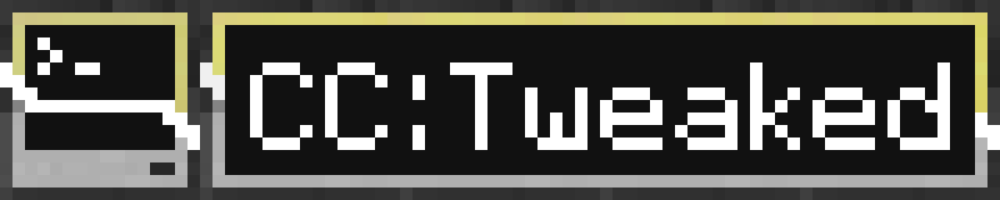

[](https://github.com/cc-tweaked/CC-Tweaked/actions "Current build status") [][CurseForge] [![Download CC: Tweaked on Modrinth](https://img.shields.io/badge/dynamic/json?color=5da545&label=modrinth&prefix=downloads%20&query=downloads&url=https://api.modrinth.com/api/v1/mod/cc-tweaked&style=for-the-badge&logo=data:image/svg+xml;base64,PHN2ZyB4bWxucz0iaHR0cDovL3d3dy53My5vcmcvMjAwMC9zdmciIHZpZXdCb3g9IjAgMCAxMSAxMSIgd2lkdGg9IjE0LjY2NyIgaGVpZ2h0PSIxNC42NjciICB4bWxuczp2PSJodHRwczovL3ZlY3RhLmlvL25hbm8iPjxkZWZzPjxjbGlwUGF0aCBpZD0iQSI+PHBhdGggZD0iTTAgMGgxMXYxMUgweiIvPjwvY2xpcFBhdGg+PC9kZWZzPjxnIGNsaXAtcGF0aD0idXJsKCNBKSI+PHBhdGggZD0iTTEuMzA5IDcuODU3YTQuNjQgNC42NCAwIDAgMS0uNDYxLTEuMDYzSDBDLjU5MSA5LjIwNiAyLjc5NiAxMSA1LjQyMiAxMWMxLjk4MSAwIDMuNzIyLTEuMDIgNC43MTEtMi41NTZoMGwtLjc1LS4zNDVjLS44NTQgMS4yNjEtMi4zMSAyLjA5Mi0zLjk2MSAyLjA5MmE0Ljc4IDQuNzggMCAwIDEtMy4wMDUtMS4wNTVsMS44MDktMS40NzQuOTg0Ljg0NyAxLjkwNS0xLjAwM0w4LjE3NCA1LjgybC0uMzg0LS43ODYtMS4xMTYuNjM1LS41MTYuNjk0LS42MjYuMjM2LS44NzMtLjM4N2gwbC0uMjEzLS45MS4zNTUtLjU2Ljc4Ny0uMzcuODQ1LS45NTktLjcwMi0uNTEtMS44NzQuNzEzLTEuMzYyIDEuNjUxLjY0NSAxLjA5OC0xLjgzMSAxLjQ5MnptOS42MTQtMS40NEE1LjQ0IDUuNDQgMCAwIDAgMTEgNS41QzExIDIuNDY0IDguNTAxIDAgNS40MjIgMCAyLjc5NiAwIC41OTEgMS43OTQgMCA0LjIwNmguODQ4QzEuNDE5IDIuMjQ1IDMuMjUyLjgwOSA1LjQyMi44MDljMi42MjYgMCA0Ljc1OCAyLjEwMiA0Ljc1OCA0LjY5MSAwIC4xOS0uMDEyLjM3Ni0uMDM0LjU2bC43NzcuMzU3aDB6IiBmaWxsLXJ1bGU9ImV2ZW5vZGQiIGZpbGw9IiM1ZGE0MjYiLz48L2c+PC9zdmc+)][modrinth]

CC: Tweaked is a mod for Minecraft which adds programmable computers, turtles and more to the game. A fork of the
much-beloved [ComputerCraft], it continues its legacy with better performance, stability, and a wealth of new features.


CC: Tweaked can be installed from [CurseForge] or [Modrinth]. It requires the [Minecraft Forge][forge] mod loader, but
[versions are available for Fabric][ccrestitched].


Any contribution is welcome, be that using the mod, reporting bugs or contributing code. If you want to get started
developing the mod, [check out the instructions here](CONTRIBUTING.md#developing).


If you need help getting started with CC: Tweaked, want to show off your latest project, or just want to chat about
ComputerCraft we have a [forum](https://forums.computercraft.cc/) and [Discord guild](https://discord.computercraft.cc)!
There's also a fairly populated, albeit quiet [IRC channel](http://webchat.esper.net/?channels=computercraft), if that's
more your cup of tea.

We also host fairly comprehensive documentation at [tweaked.cc](https://tweaked.cc/ "The CC: Tweaked website").


CC: Tweaked is hosted on my maven repo, and so is relatively simple to depend on. You may wish to add a soft (or hard)
dependency in your `mods.toml` file, with the appropriate version bounds, to ensure that API functionality you depend
on is present.

```groovy
repositories {
  maven {
    url 'https://squiddev.cc/maven/'
    content {
      includeGroup 'org.squiddev'
    }
  }
}

dependencies {
  implementation fg.deobf("org.squiddev:cc-tweaked-${mc_version}:${cct_version}")
}
```

You should also be careful to only use classes within the `dan200.computercraft.api` package. Non-API classes are
subject to change at any point. If you depend on functionality outside the API, file an issue, and we can look into
exposing more features.

We bundle the API sources with the jar, so documentation should be easily viewable within your editor. Alternatively,
the generated documentation [can be browsed online](https://tweaked.cc/javadoc/).

[computercraft]: https://github.com/dan200/ComputerCraft "ComputerCraft on GitHub"
[curseforge]: https://minecraft.curseforge.com/projects/cc-tweaked "Download CC: Tweaked from CurseForge"
[modrinth]: https://modrinth.com/mod/cc-tweaked "Download CC: Tweaked from Modrinth"
[forge]: https://files.minecraftforge.net/ "Download Minecraft Forge."
[ccrestitched]: https://www.curseforge.com/minecraft/mc-mods/cc-restitched "Download CC: Restitched from CurseForge"
