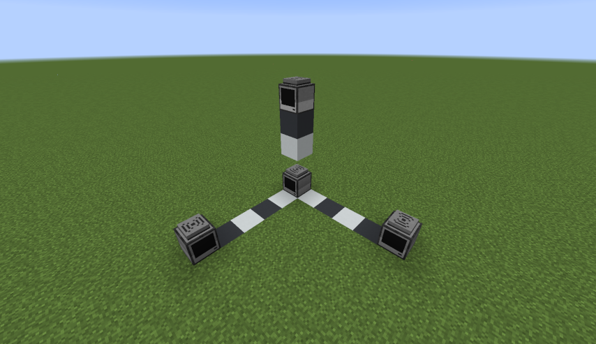

<!--
SPDX-FileCopyrightText: 2022 The CC: Tweaked Developers

SPDX-License-Identifier: MPL-2.0
-->

# Setting up GPS
The [`gps`] API allows computers and turtles to find their current position using wireless modems.

In order to use GPS, you'll need to set up multiple *GPS hosts*. These are computers running the special `gps host`
program, which tell other computers the host's position. Several hosts running together are known as a *GPS
constellation*.

In order to give the best results, a GPS constellation needs at least four computers. More than four GPS hosts per
constellation is redundant, but it does not cause problems.

## Building a GPS constellation


We are going to build our GPS constellation as shown in the image above. You will need 4 computers and either 4 wireless
modems or 4 ender modems. Try not to mix ender and wireless modems together as you might get some odd behavior when your
requesting computers are out of range.

> [Ender modems vs wireless modems][!TIP]
> Ender modems have a very large range, which makes them very useful for setting up GPS hosts. If you do this then you
> will likely only need one GPS constellation for the whole dimension (such as the Overworld or Nether).
>
> If you do use wireless modems then you may find that you need multiple GPS constellations to cover your needs.
>
> A computer needs a wireless or ender modem and to be in range of a GPS constellation that is in the same dimension as
> it to use the GPS API. The reason for this is that ComputerCraft mimics real-life GPS by making use of the distance
> parameter of [modem messages][`modem_message`] and some maths.

Locate where you want to place your GPS constellation. You will need an area at least 6 blocks high, 6 blocks wide, and
6 blocks deep (6x6x6). If you are using wireless modems then you may want to build your constellation as high as you can
because high altitude boosts modem message range and thus the radius that your constellation covers.

The GPS constellation will only work when it is in a loaded chunk. If you want your constellation to always be
accessible, you may want to permanently load the chunk using a vanilla or modded chunk loader. Make sure that your 6x6x6
area fits in a single chunk to reduce the number of chunks that need to be kept loaded.

Let's get started building the constellation! Place your first computer in one of the corners of your 6x6x6. Remember
which computer this is as other computers need to be placed relative to it. Place the second computer 4 blocks above the
first. Go back to your first computer and place your third computer 5 blocks in front of your first computer, leaving 4
blocks of air between them. Finally for the fourth computer, go back to your first computer and place it 5 blocks right
of your first computer, leaving 4 blocks of air between them.

With all four computers placed within the 6x6x6, place one modem on top of each computer. You should have 4 modems and 4
computers all within your 6x6x6 where each modem is attached to a computer and each computer has a modem.

Currently your GPS constellation will not work, that's because each host is not aware that it's a GPS host. We will fix
this in the next section.

## Configuring the constellation
Now that the structure of your constellation is built, we need to configure each host in it.

Go back to the first computer that you placed and create a startup file, by running `edit startup`.

Type the following code into the file:
```lua
shell.run("gps", "host", x, y, z)
```

Escape from the computer GUI and then press <kbd>F3</kbd> to open Minecraft's debug screen and then look at the computer
(without opening the GUI). On the right of the screen about halfway down you should see an entry labeled `Targeted
Block`, the numbers correspond to the position of the block that you are looking at. Replace `x` with the first number,
`y` with the second number, and `z` with the third number.

For example, if I had a computer at x = 59, y = 5, z = -150, then my <kbd>F3</kbd> debug screen entry would be `Target
Block: 59, 5, -150` and I would change my startup file to this `shell.run("gps", "host", 59, 5, -150)`.

To hide Minecraft's debug screen, press <kbd>F3</kbd> again.

Create similar startup files for the other computers in your constellation, making sure to input the each computer's own
coordinates.

> [Modem messages come from the computer's position, not the modem's][!WARNING]
> Wireless modems transmit from the block that they are attached to *not* the block space that they occupy, the
> coordinates that you input into your GPS host should be the position of the computer and not the position of the modem.

Congratulations, your constellation is now fully set up! You can test it by placing another computer close by, placing a
wireless modem on it, and running the `gps locate` program (or calling the [`gps.locate`] function).

> [Why use Minecraft's coordinates?][!INFO]
> CC doesn't care if you use Minecraft's coordinate system, so long as all of the GPS hosts with overlapping ranges use
> the same reference point (requesting computers will get confused if hosts have different reference points). However,
> using MC's coordinate system does provide a nice standard to adopt server-wide. It also is consistent with how command
> computers get their location, they use MC's command system to get their block which returns that in MC's coordinate
> system.
