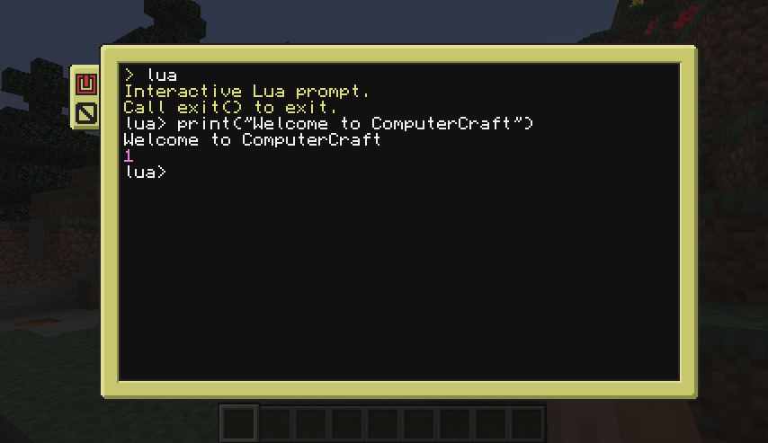
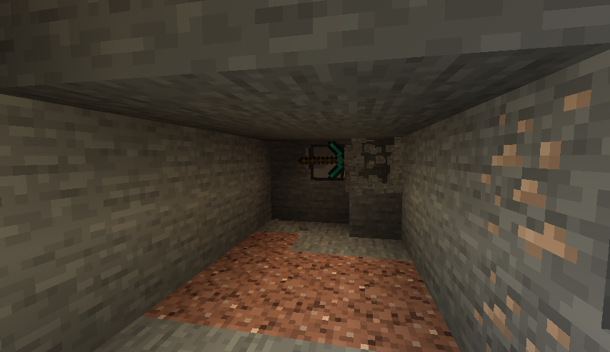

# 
CC: Tweaked is a mod for Minecraft which adds programmable computers, turtles and more to the game. A fork of the
much-beloved [ComputerCraft], it continues its legacy with better performance, stability, and a wealth of new features.

CC: Tweaked can be installed from [CurseForge] or [Modrinth]. It requires the [Minecraft Forge][forge] mod loader, but
[versions are available for Fabric][ccrestitched].

## Features
Controlled using the [Lua programming language][lua], CC: Tweaked's computers provides all the tools you need to start
writing code and automating your Minecraft world.

{.big-image}

While computers are incredibly powerful, they're rather limited by their inability to move about. *Turtles* are the
solution here. They can move about the world, placing and breaking blocks, swinging a sword to protect you from zombies,
or whatever else you program them to!

{.big-image}

Not all problems can be solved with a pickaxe though, and so CC: Tweaked also provides a bunch of additional peripherals
for your computers. You can play a tune with speakers, display text or images on a monitor, connect all your
computers together with modems, and much more.

Computers can now also interact with inventories such as chests, allowing you to build complex inventory and item
management systems.

{.big-image}

## Getting Started
While ComputerCraft is lovely for both experienced programmers and for people who have never coded before, it can be a
little daunting getting started. Thankfully, there's several fantastic tutorials out there:

 - [Direwolf20's ComputerCraft tutorials](https://www.youtube.com/watch?v=wrUHUhfCY5A "ComputerCraft Tutorial Episode 1 - HELP! and Hello World")
 - [Sethbling's ComputerCraft series](https://www.youtube.com/watch?v=DSsx4VSe-Uk "Programming Tutorial with Minecraft Turtles -- Ep. 1: Intro to Turtles and If-Then-Else_End")
 - [Lyqyd's Computer Basics 1](http://www.computercraft.info/forums2/index.php?/topic/15033-computer-basics-i/ "Computer Basics I")

Once you're a little more familiar with the mod, the sidebar and links below provide more detailed documentation on the
various APIs and peripherals provided by the mod.

If you get stuck, do pop in to the [Minecraft Computer Mod Discord guild][discord] or ComputerCraft's
[IRC channel][irc].

## Get Involved
CC: Tweaked lives on [GitHub]. If you've got any ideas, feedback or bugs please do [create an issue][bug].

[github]: https://github.com/cc-tweaked/CC-Tweaked/ "CC: Tweaked on GitHub"
[bug]: https://github.com/cc-tweaked/CC-Tweaked/issues/new/choose
[computercraft]: https://github.com/dan200/ComputerCraft "ComputerCraft on GitHub"
[curseforge]: https://minecraft.curseforge.com/projects/cc-tweaked "Download CC: Tweaked from CurseForge"
[modrinth]: https://modrinth.com/mod/gu7yAYhd "Download CC: Tweaked from Modrinth"
[forge]: https://files.minecraftforge.net/ "Download Minecraft Forge."
[ccrestitched]: https://www.curseforge.com/minecraft/mc-mods/cc-restitched "Download CC: Restitched from CurseForge"
[lua]: https://www.lua.org/ "Lua's main website"
[discord]: https://discord.computercraft.cc "The Minecraft Computer Mods Discord"
[irc]: http://webchat.esper.net/?channels=computercraft "IRC webchat on EsperNet"
