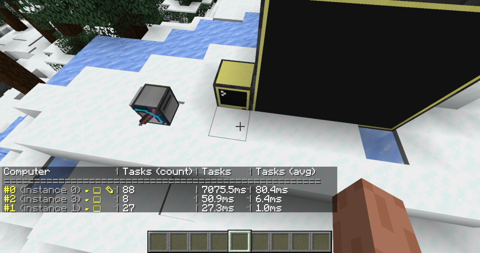

<!--
SPDX-FileCopyrightText: 2023 The CC: Tweaked Developers

SPDX-License-Identifier: MPL-2.0
-->

# The `/computercraft` command
CC: Tweaked provides a `/computercraft` command for server owners to manage running computers on a server.

## Permissions {#permissions}
As the `/computercraft` command is mostly intended for debugging and administrative purposes, its sub-commands typically
require you to have op (or similar).

 - All players have access to the [`queue`] sub-command.
 - On a multi-player server, all other commands require op.
 - On a single-player world, the player can run the [`dump`], [`turn-on`]/[`shutdown`], and [`track`] sub-commands, even
   when cheats are not enabled. The [`tp`] and [`view`] commands require cheats.

If a permission mod such as [LuckPerms] is installed[^permission], you can configure access to the individual
sub-commands. Each sub-command creates a `computercraft.command.NAME` permission node to control which players can
execute it.

[LuckPerms]: https://github.com/LuckPerms/LuckPerms/ "A permissions plugin for Minecraft servers."
[fabric-permission-api]: https://github.com/lucko/fabric-permissions-api "A simple permissions API for Fabric"

[^permission]: This supports any mod which uses Forge's permission API or [fabric-permission-api].

## Computer selectors {#computer-selectors}
Some commands (such as [`tp`] or [`turn-on`]) target a specific computer, or a list of computers. To specify which
computers to operate on, you must use "computer selectors".

Computer selectors are similar to Minecraft's [entity target selectors], but targeting computers instead. They allow
you to select one or more computers, based on a set of predicates.

The following predicates are supported:
 - `id=<id>`: Select computer(s) with a specific id.
 - `instance=<id>`: Select the computer with the given instance id.
 - `family=<normal|advanced|command>`: Select computers based on their type.
 - `label=<label>`: Select computers with the given label.
 - `distance=<distance>`: Select computers within a specific distance of the player executing the command. This uses
   Minecraft's [float range] syntax.

`#<id>` may also be used as a shorthand for `@c[id=<id>]`, to select computer(s) with a specific id.

### Examples:
 - `/computercraft turn-on #12`: Turn on the computer(s) with an id of 12.
 - `/computercraft shutdown @c[distance=..100]`: Shut down all computers with 100 blocks of the player.

[entity target selectors]: https://minecraft.wiki/w/Target_selectors "Target Selectors on the Minecraft wiki"
[Float range]: https://minecraft.wiki/w/Argument_types#minecraft:float_range

## Commands {#commands}
### `/computercraft dump` {#dump}
`/computercraft dump` prints a table of currently loaded computers, including their id, position, and whether they're
running. It can also be run with a single computer argument to dump more detailed information about a computer.

Next to the computer id, there are several buttons to either [teleport][`tp`] to the computer, or [open its terminal
][`view`].

 Computers are sorted by distance to the player, so nearby computers will appear earlier.

### `/computercraft turn-on [computers...]` {#turn-on}
Turn on one or more computers or, if no run with no arguments, all loaded computers.

#### Examples
 - `/computercraft turn-on #0 #2`: Turn on computers with id 0 and 2.
 - `/computercraft turn-on @c[family=command]`: Turn on all command computers.

### `/computercraft shutdown [computers...]` {#shutdown}
Shutdown one or more computers or, if no run with no arguments, all loaded computers.

This is sometimes useful when dealing with lag, as a way to ensure that ComputerCraft is not causing problems.

#### Examples
 - `/computercraft shutdown`: Shut down all loaded computers.
 - `/computercraft shutdown @c[distance=..10]`: Shut down all computers in a block radius.

### `/computercraft tp [computer]` {#tp}
Teleport to the given computer.

This is normally used from via the [`dump`] command interface rather than being invoked directly.

### `/computercraft view [computer]` {#view}
Open a terminal for the specified computer. This allows remotely viewing computers without having to interact with the
block.

This is normally used from via the [`dump`] command interface rather than being invoked directly.

### `/computercraft track` {#track}
The `/computercraft track` command allows you to enable profiling of computers. When a computer runs code, or interacts
with the Minecraft world, we time how long that takes. This timing information may then be queried, and used to find
computers which may be causing lag.

To enable the profiler, run `/computercraft track start`. Computers will then start recording metrics. Once enough data
has been gathered, run `/computercraft track stop` to stop profiling and display the recorded data.

The table by default shows the number of times each computer has run, and how long it ran for (in total, and on
average). In the above screenshot, we can see one computer was particularly badly behaved, and ran for 7 seconds. The
buttons may be used to [teleport][`tp`] to the computer, or [open its terminal ][`view`], and inspect it further.

`/computercraft track dump` can be used to display this table at any point (including while profiling is still running).

Computers also record other information, such as how much server-thread time they consume, or their HTTP bandwidth
usage. The `dump` subcommand accepts a list of other fields to display, instead of the default timings.

#### Examples
 - `/computercraft track dump server_tasks_count server_tasks`: Print the number of server-thread tasks each computer
   executed, and how long they took in total.
 - `/computercraft track dump http_upload http_download`: Print the number of bytes uploaded and downloaded by each
   computer.

### `/computercraft queue` {#queue}
The queue subcommand allows non-operator players to queue a `computer_command` event on *command* computers.

This has a similar purpose to vanilla's [`/trigger`] command. Command computers may choose to listen to this event, and
then perform some action.

[`/trigger`]: https://minecraft.wiki/w/Commands/trigger "/trigger on the Minecraft wiki"

[`dump`]: #dump "/computercraft dump"
[`queue`]: #queue "/computercraft queue"
[`shutdown`]: #shutdown "/computercraft shutdown"
[`tp`]: #tp "/computercraft tp"
[`track`]: #track "/computercraft track"
[`turn-on`]: #turn-on "/computercraft turn-on"
[`view`]: #view "/computercraft view"
[computer selectors]: #computer-selectors "Computer selectors"
