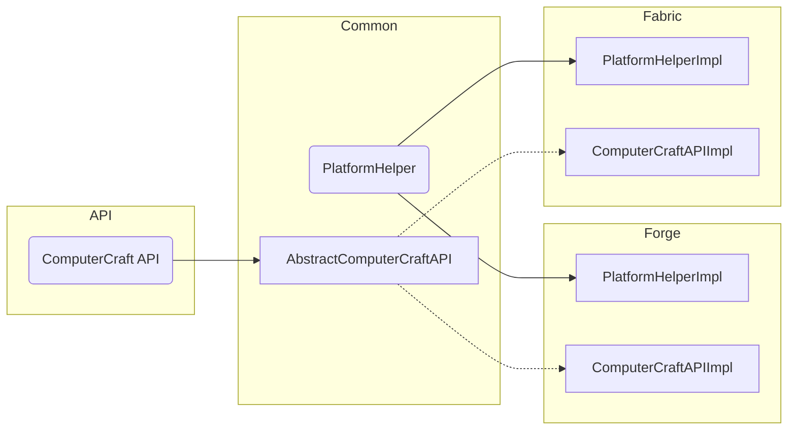

<!--
SPDX-FileCopyrightText: 2022 The CC: Tweaked Developers

SPDX-License-Identifier: MPL-2.0
-->

# Architecture
CC: Tweaked has a rather complex project layout, as there's several use-cases we want to support (multiple mod loaders,
usable outside of Minecraft). As such, it can be tricky to understand how the code is structured and how the various
sub-projects interact. This document provides a high-level overview of the entire mod.

## Project Outline
CC: Tweaked is split into 4 primary modules (`core`, `common`, `fabric`, `forge`). These themselves are then split into
a public API (i.e `core-api`) and the actual implementation (i.e. `core`).

 - `core`: This contains the core "computer" part of ComputerCraft, such as the Lua VM, filesystem and builtin APIs.
   This is also where the Lua ROM is located (`projects/core/src/main/resources/data/computercraft/lua`). Notably this
   project does _not_ depend on Minecraft, making it possible to use it in emulators and other tooling.

 - `common`: This contains all non mod-loader-specific Minecraft code. This is where computers, turtles and peripherals
   are defined (and everything else Minecraft-related!).

   This project is separates client code into its own separate source set (suitably named `client`). This helps us
   ensure that server code can never reference client-only code (such as LWJGL).

 - `forge` and `fabric`: These contain any mod-loader specific code.

When we need to call loader-specific code from our own code (for instance, sending network messages or firing
loader-specific events), we use a `PlatformHelper` interface (defined in
`projects/common/src/main/java/dan200/computercraft/shared/platform/PlatformHelper.java`). This abstracts over most
loader-specific code we need to use, and is then implemented by each mod-loader-specific project. The concrete
implementation is then loaded with Java's [`ServiceLoader`][ServiceLoader], in a design based on [jaredlll08's
multi-loader template][MultiLoader-Template]. We use a similar system for communicating between the API and its
implementation.



Note the `PlatformHelper` is only used when calling from our code into loader-specific code. While we use this to _fire_
events, we do not use it to _subscribe_ to events. For that we just subscribe to the events in the loader-specific
project, and then dispatch to the common `CommonHooks` (for shared code) and `ClientHooks` (for client-specific code).

You may notice there's a couple of other, smaller modules in the codebase. These you can probably ignore, but are worth
mentioning:

 - `lints`: This defines an [ErrorProne] plugin which adds a couple of compile-time checks to our code. This is what
   enforces that no client-specific code is used inside the `main` source set (and a couple of other things!).

 - `standalone`: This contains a standalone UI for computers, allowing debugging and development of CraftOS without
   launching Minecraft.

 - `web`: This contains the additional tooling for building [the documentation website][tweaked.cc], such as support for
   rendering recipes

 - `buildSrc` (in the base directory, not in `projects/`): This contains any build logic shared between modules. For
   instance, `cc-tweaked.java-convention.gradle.kts` sets up the defaults for Java that we use across the whole project.

> **Note**
> The Forge and Fabric modules (and their API counterparts) depend on the common modules. However, in order to correctly
> process mixins we need to compile the common code along with the Forge/Fabric code. This leads to a slightly strange
> build process:
>
>  - In your IDE, Forge/Fabric depend on the common as normal.
>  - When building via Gradle, the common code is compiled alongside Forge/Fabric.
>
> You shouldn't need to worry about this - it should all be set up automatically - but hopefully explains a little bit
> why our Gradle scripts are slightly odd!

## Testing
CC: Tweaked has a small (though growing!) test suite to ensure various features behave correctly. Most tests are written
in Java using [JUnit], though we also make use of [jqwik] for property testing.

### Test Fixtures
Some projects define an additional `testFixtures` folder alongside their main `test` code (i.e.
`projects/core/src/testFixtures`). This source set contains test-related code which might be consumed in dependent
projects. For instance, core's test fixtures defines additional [Hamcrest] matchers, which are used in both `core` and
`common`'s test suite.

Test fixtures may also define [Test Interfaces]. This is a pattern for writing tests to ensure that an implementation
obeys its interface's contract. For instance, we might have a `ListContract` test, which asserts an abstract list
behaves as expected:

```java
interface ListContract<T extends List<Integer>> {
    T newList();

    @Test
    default void testAddInsert() {
        var list = newList();
        assertTrue(list.add(123));
        assertTrue(list.contains(123));
    }
}
```

We can then use this interface to create tests for a specific implementation:

```java
class ArrayListTest implements ListContract<ArrayList<Integer>> {
    @Override public ArrayList<Integer> newList() { return new ArrayList<>(); }
}
```

This is especially useful when testing `PlatformHelper` and other mod loader abstractions.

### Lua tests
While the majority of CC: Tweaked is written in Java, a significant portion of the code is written in Lua. As such, it's
also useful to test that.

This is done by starting a Lua VM with all of ComputerCraft's APIs loaded, then starting a custom test framework
(`mcfly.lua`). This test framework discovers tests and sends them back to the Java side. These are turned into JUnit
tests which are then in turn run on the computer again. This allows the tests to integrate with existing Java testing
tooling (for instance, XML test reports and IDE integration).

There's a slightly more detailed description of the process at `ComputerTestDelegate.java`.

### Game tests
CC: Tweaked also runs several tests in-game using Minecraft's [gametest framework][mc-test]. These work by starting
a Minecraft server and then, for each test, spawning a structure and then interacting with the blocks inside the
structure, asserting they behave as expected.

Unlike most of our other tests, these are written in Kotlin. We make extensive use of [extension methods] to augment
vanilla's own test classes, which helps give a more consistent feel to the API.

Each test works by defining a sequence of steps. Each step can either run an action (`thenExecute`), sleep for a period
(`thenIdle`) or sleep until a condition is met (`thenWaitUntil`).

```kotlin
fun Some_test(context: GameTestHelper) = context.sequence {
    thenExecute { context.setBlock(BlockPos(2, 2, 2), Blocks.AIR) }
    thenIdle(4)
    thenExecute { context.assertBlockHas(lamp, RedstoneLampBlock.LIT, false, "Lamp should not be lit") }
}
```

Some tests need to use Lua APIs from a computer, such as when testing `turtle.dig`. In order to do this, we install
a custom "Lua" runtime (see `ManagedComputers.kt`) which actually runs Java functions. Tests can then enqueue a function
to run on a particular computer and then wait for it to finish.

While the internals of this is quite complex, it ends up being a much nicer workflow than writing parts of the test in
Lua. It also ends up being much more efficient, which is important when running a dozen tests at once!

[MultiLoader-Template]: https://github.com/jaredlll08/MultiLoader-Template/ "MultiLoader-Template - A template for a Forge + Fabric project setup using a Common source set."
[ServiceLoader]: https://docs.oracle.com/en/java/javase/17/docs/api/java.base/java/util/ServiceLoader.html "ServiceLoader (Java SE 17 and JDK 17)"
[ErrorProne]: https://errorprone.info/ "ErrorProne"
[tweaked.cc]: https://tweaked.cc "CC: Tweaked"
[JUnit]: https://junit.org/junit5/ "JUnit 5"
[jqwik]: https://jqwik.net/
[Hamcrest]: https://hamcrest.org/JavaHamcrest/ "Java Hamcrest"
[Test Interfaces]: https://junit.org/junit5/docs/current/user-guide/#writing-tests-test-interfaces-and-default-methods
[mc-test]: https://www.youtube.com/watch?v=vXaWOJTCYNg "Testing Minecraft in Minecraft on YouTube"
[extension methods]: https://kotlinlang.org/docs/extensions.html "Extensions | Kotlin"
